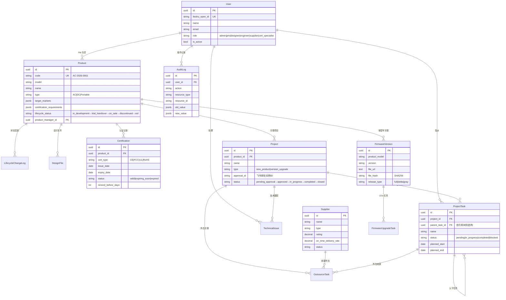

# PLM 系统架构全景图

> 生成日期: 2026-06-11 | 修订: 2026-06-12 聚焦纯产品生命周期管理
> 基于实际代码分析

---

## 1. 系统部署架构

```
                        ┌─────────────────────────────────┐
                        │         🌐 用户入口               │
                        │     浏览器  │  飞书工作台         │
                        └──────┬──────────┬────────────────┘
                               │          │
                               ▼          ▼
                        ┌─────────────────────────────────┐
                        │           Nginx :443             │
                        │    TLS 终止 · 反向代理 · GZip    │
                        └──────────┬──────────────────────┘
                                   │
              ┌────────────────────┼────────────────────┐
              │                    │                    │
              ▼                    ▼                    ▼
    ┌─────────────────┐  ┌─────────────────┐  ┌─────────────────┐
    │   🟢 Frontend   │  │   🟢 Backend    │  │   🟢 MinIO      │
    │   React 18 SPA  │  │  FastAPI :8000  │  │   S3 :9000      │
    │   Vite :5173    │  │                 │  │   Console :9001  │
    └────────┬────────┘  └───────┬─────────┘  └─────────────────┘
             │                   │
             │    REST JSON      │
             └───────────────────┘
                                 │
              ┌──────────────────┼──────────────────┐
              │                  │                  │
              ▼                  ▼                  ▼
    ┌─────────────────┐  ┌─────────────┐  ┌─────────────────┐
    │  🟢 PostgreSQL  │  │  🟢 Redis   │  │  🌐 飞书 Open   │
    │  16 :5432       │  │  7 :6379    │  │     API        │
    │  (12 张表)       │  │  Token缓存  │  └─────────────────┘
    └─────────────────┘  └─────────────┘

Docker Compose 一键启动: docker-compose up -d
目标生产环境: K8s (规划中)
```

---

## 2. 后端分层架构

```
┌──────────────────────────────────────────────────────────────┐
│                      📡 API 路由层 (10 模块)                   │
│                                                              │
│  auth  dashboard  products  projects  design  suppliers     │
│  firmware  analytics  certifications  admin  callbacks      │
│                                                              │
│  统一响应: { success: bool, data: T, message?: string }      │
├──────────────────────────────────────────────────────────────┤
│                      🧠 业务逻辑层 (9 service)                │
│                                                              │
│  AuthService  ProductService   ProjectService               │
│  DesignService  SupplierService  FirmwareService            │
│  CertificationService  AnalyticsService                     │
│  AdminService  DashboardService                             │
│                                                              │
│  ↑ 状态机校验 · 业务规则 · 事件发布 · 通知触发                 │
├──────────────────────────────────────────────────────────────┤
│                      🗄️ 数据访问层 (7 repository)             │
│                                                              │
│  UserRepo  ProductRepo  ProjectRepo  DesignRepo             │
│  SupplierRepo  FirmwareRepo  CertificationRepo              │
│                                                              │
│  ↑ SQLAlchemy 2.0 async 查询封装                              │
├──────────────────────────────────────────────────────────────┤
│                      📦 ORM 模型层 (12 实体)                   │
│                                                              │
│  User  Product  LifecycleChangeLog  Project  ProjectTask    │
│  TechnicalIssue  DesignFile  Supplier  OutsourceTask        │
│  Certification  FirmwareVersion  FirmwareUpgradeTask        │
│  AuditLog                                                   │
├──────────────────────────────────────────────────────────────┤
│                      🧱 基础设施层                             │
│                                                              │
│  core/config.py       ← Pydantic Settings (环境变量)          │
│  core/database.py     ← AsyncEngine + session factory        │
│  core/security.py     ← JWT 签发/验证 + 密码哈希              │
│  core/deps.py         ← FastAPI 依赖注入 (get_db/CurrentUser) │
│  core/event_bus.py    ← 发布/订阅 解耦通知                    │
│  core/scheduler.py    ← 后台定时任务 (认证过期检查)            │
│  core/minio_client.py ← S3 文件上传/下载                      │
│                                                              │
│  middleware/audit.py        ← 审计日志模型 + 写入工具          │
│  middleware/error_handler.py ← 全局异常捕获                    │
│                                                              │
│  integrations/feishu/  ← auth · bot · approval · task · cal │
└──────────────────────────────────────────────────────────────┘
```

---

## 3. 数据模型 ER 图



---

## 4. 产品生命周期状态机

```
    ┌──────────────┐
    │ in_development│ ◄──────────────┐
    │  (研发中)      │                │
    └──────┬───────┘                │
           │ trial_handover         │ 打回
           ▼                        │
    ┌──────────────┐                │
    │trial_handover├────────────────┘
    │  (试产交接)   │
    └──────┬───────┘
           │ on_sale
           ▼
    ┌──────────────┐
    │   on_sale    │
    │  (在售)       │
    └──────┬───────┘
           │ discontinued
           ▼
    ┌──────────────┐
    │ discontinued │
    │  (停产)       │
    └──────┬───────┘
           │ eol
           ▼
    ┌──────────────┐
    │     eol      │  ← 终态，不可逆
    │  (生命周期结束)│
    └──────────────┘
```

---

## 5. 飞书集成全景

```
┌─────────────────────────────────────────────────────────┐
│                    飞书 Open API                         │
│                                                         │
│  ┌─────────┐  ┌──────────┐  ┌────────┐  ┌───────────┐ │
│  │  SSO    │  │ 审批     │  │ 消息   │  │ 任务中心  │ │
│  │ OAuth   │  │ Approval │  │ Bot    │  │ Task      │ │
│  │ ✅      │  │ ✅       │  │ ✅     │  │ ✅        │ │
│  └────┬────┘  └────┬─────┘  └───┬────┘  └─────┬─────┘ │
│       │            │            │              │       │
│  ┌────┴────┐  ┌────┴─────┐  ┌──┴──────┐  ┌───┴─────┐ │
│  │ 日历    │  │ 事件订阅 │  │ Tenant  │  │ 回调    │ │
│  │ Calendar│  │ Event    │  │ Token   │  │ Callback│ │
│  │ ✅      │  │ 🟡      │  │ ✅ Redis │  │ ✅     │ │
│  └─────────┘  └──────────┘  └─────────┘  └─────────┘ │
│                                                       │
└───────────────────────────────────────────────────────┘

数据流:
  浏览器 → /auth/feishu/login → 飞书授权页 → code → /auth/feishu/callback
                                                      │
                                                      ▼
                                           换取 user_info → 创建/更新 User
                                                      │
                                                      ▼
                                              签发 JWT (access + refresh)
```

---

## 6. 事件总线通信

```
┌──────────────────────────────────────────────────┐
│                  EventBus                        │
│                                                  │
│  发布者 (Publishers)          订阅者 (Subscribers) │
│  ──────────────────          ──────────────────  │
│                                                  │
│  ProductService              event_handlers.py   │
│    │ publish(product.         ├─ task.assigned   │
│      discontinued)           │    → 飞书卡片消息 │
│                              │                   │
│  ProjectService              ├─ task.overdue     │
│    │ publish(approval.       │    → 飞书催办     │
│      approved)               │                   │
│                              ├─ cert.expiring    │
│  Scheduler                    │    → 飞书到期提醒 │
│    │ publish(cert.            │                   │
│      expiring)                ├─ approval.approved│
│                              │    → 飞书通知PM   │
│  Feishu Callback             │                   │
│    │ publish(approval.*)      └─ product.discontinued│
│                                                  │
└──────────────────────────────────────────────────┘
```

---

## 7. 前端组件树

```
App
└─ MainLayout
   ├─ Sidebar (可折叠)
   │  ├─ 🟢 Dashboard        /dashboard
   │  ├─ 🟢 Products         /products
   │  ├─ 🟢 Projects         /projects
   │  ├─ 🟢 Design Files     /design
   │  ├─ 🟢 Suppliers        /suppliers
   │  ├─ 🟢 Lifecycle Mgmt   /lifecycle
   │  ├─ 🟢 Firmware OTA     /firmware
   │  ├─ 🟢 Analytics        /analytics
   │  ├─ 🟢 Certifications   /certifications
   │  └─ 🟢 Admin            /admin
   ├─ Header
   │  ├─ Language Switch (zh-CN / en-US)
   │  └─ User Avatar + Dropdown
   │     ├─ Settings         /settings
   │     └─ Logout
   └─ Content Area (React Router Outlet)

状态管理:
  Zustand  ── authStore (token, user, login/logout)
           ── appStore  (language, sidebarCollapsed)
  React Query ── 服务端数据缓存 + 自动刷新

路由守卫: ProtectedRoute → 检查 access_token, 无则跳 /login
Axios 拦截器: 自动注入 Bearer Token, 401 自动跳登录
```

---

## 8. 模块完成度矩阵

```
模块             后端API    后端Service  后端Repo    前端页面   状态
──────────────────────────────────────────────────────────────
Auth             ✅ 完整      ✅ 完整      ✅ 完整     ✅ 完整    ✅
Dashboard        ✅ 完整      ✅ 完整      N/A         ✅ 完整    ✅
Products         ✅ 完整      ✅ 完整      ✅ 完整     ✅ 完整    ✅
Projects         ✅ 完整      ✅ 完整      ✅ 完整     ✅ 完整    ✅
Design Files     ✅ 完整      ✅ 完整      ✅ 完整     ✅ 完整    ✅
Suppliers        ✅ 完整      ✅ 完整      ✅ 完整     ✅ 完整    ✅
Firmware OTA     ✅ 完整      ✅ 完整      ✅ 完整     ✅ 完整    ✅
Analytics        ✅ 完整      ✅ 完整      N/A         ✅ 完整    ✅
Certifications   ✅ 完整      ✅ 完整      ✅ 完整     ✅ 完整    ✅
Admin            ✅ 完整      ✅ 完整      ✅ 完整     ✅ 完整    ✅
Feishu Callbacks ✅ 完整      N/A          N/A         N/A        ✅
──────────────────────────────────────────────────────────────
整体完成度: ~100% (所有模块均已完成)
```

---

## 9. 技术债务与演进路线

| 优先级 | 条目 | 影响 | 建议 |
|--------|------|------|------|
| P0 | 单元测试覆盖 | 质量 | 补充 service 层单元测试 |
| P1 | Redis 缓存策略 | 性能 | 对高频查询(产品列表/项目列表)增加缓存 |
| P1 | SQL N+1 优化 | 性能 | 对关联查询使用 selectinload/joinedload |
| P2 | 分页重复代码 | 维护 | 抽取通用分页工具 |
| P2 | K8s 部署 | 运维 | 完成 K8s 部署配置 |
| P3 | 飞书事件订阅 | 功能 | 补充飞书事件订阅实现 |
```
