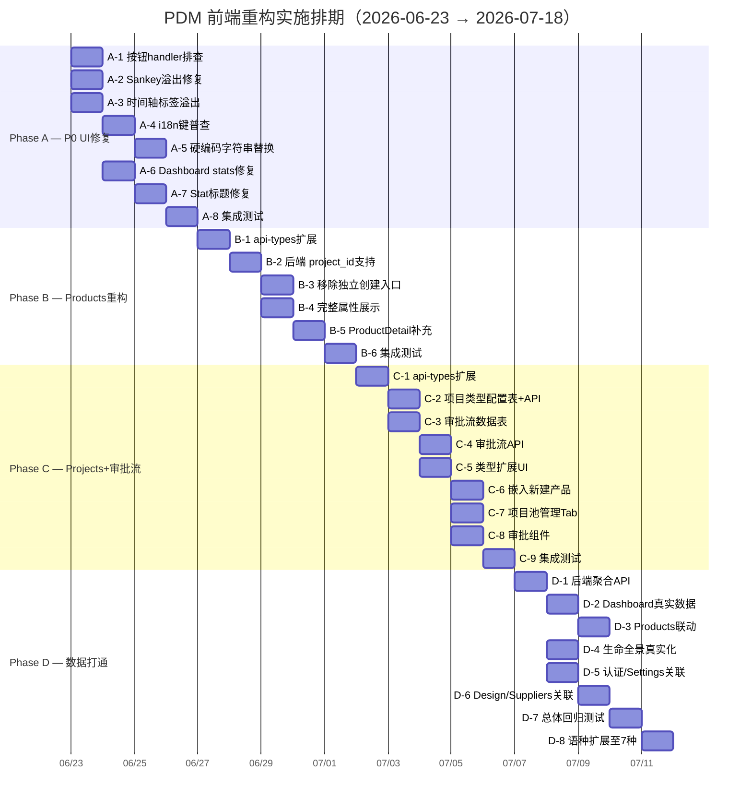

# PDM 前端重构实施计划

> 实施日期: 2026-06-23 → 2026-07-18 (约 4 周)
> 项目: Product_develop_management — 问题 1-7 全面修复
> PM: Brain PM Agent | 技术栈: React 18 + TS + Vite + Ant Design 5 + ECharts + zustand

---

## 一、需求质疑

### 用户 7 条需求合理性分析

| # | 需求 | 质疑 | 结论 |
|---|------|------|------|
| 1 | 大量按钮不生效 | 经代码审查，Products/Projects/Dashboard 按钮均有 handler。**可能问题在 Design/Suppliers/Lifecycle/Analytics 等页面**，或报告者有特殊操作场景 | ✅ 保留，缩小范围 |
| 2 | 文字溢出文本框 | 确认 3 处溢出（Sankey 标签、时间轴步骤名、产品名截断逻辑不完整） | ✅ 保留 |
| 3 | 中英文本混杂 | 确认 20+ 处硬编码中文/英文，i18n 键缺失（common.desc 等） | ✅ 保留 |
| 4 | 产品管理重构（产品来自项目） | **核心架构变更**，需要后端配合（产品表的 project_id 字段）。如果后端尚未就绪，前端可先做交互层占位 | ✅ 保留，列为 P1 |
| 5 | 项目管理重构（新产品类型+可配置） | 项目类型从枚举改为数据库配置 → 需要后端新增 `project_type_configs` 表。前端先做类型扩展（2→4） | ✅ 保留，列为 P1 |
| 6 | 项目审批流 | **全新功能**——需要完整审批节点/状态/动作/角色模型。前期可做"简化版"（单级审批 + 意见字段） | ⚠️ 建议拆分：Phase C1 简化版 → Phase C2 完整版 |
| 7 | 所有页面数据同源 | 需要后端聚合 API（如 `/dashboard/stats/realtime`）。前期限做 Dashboard 数据打通（从真实 product/project list 计算） | ✅ 保留，列为 P2 |

### 建议简化/合并

1. **需求 4+5 合并**：Products 与 Projects 的重构是同一枚硬币的两面，不应拆分实施。设计为**一个大任务**统一排期。
2. **需求 6 拆分两阶段**：先做"简化审批流"（单级批准/拒绝，带意见文本）解决即期需求，再考虑多节点审批。
3. **需求 1+2+3 合并为"UI 修复 Sprint"**：同为 P0 级别，统一由 ui-designer 批次修复。

---

## 二、架构决策

### ADR-001: Products-Project 数据关系

**决策：** 产品必须归属于项目，禁止独立创建产品。

```
Project (1) ──hasMany──▶ Product (N)
  │                         │
  │ type: new_product       │ lifecycle_status
  │       version_upgrade   │ target_markets
  │       certification     │ cert_requirements
  │       other             │
```

**实施规则：**
1. Products 页面移除"新建"按钮和 Create Modal
2. 创建项目 Modal 中嵌入"新建产品"子表单（产品编码/型号/名称/类型/目标市场/认证要求）
3. 新建项目时：要么选择已有产品 → 要么在弹窗中同时创建新产品
4. Products 页面只保留列表视图 + 详情页，作为产品数据的查看和管理入口

### ADR-002: 审批流数据模型

**设计：**

```
ProjectApprovalTemplate               ApprovalFlowInstance
┌─────────────────────┐              ┌──────────────────────────┐
│ id: UUID            │ 1         N  │ id: UUID                 │
│ name: string        │◄────────────│ project_id: UUID          │
│ project_type: enum  │              │ template_id: UUID        │
│ description: string │              │ status: pending/approved │
└─────────────────────┘              │         /rejected/closed │
        │ 1                          │ created_at               │
        │                            └──────────────────────────┘
        │ N                                   │ 1
        ▼                                     │
ApprovalNode                                  │
┌─────────────────────┐              ┌────────▼─────────────────┐
│ id: UUID            │              │ ApprovalNodeInstance     │
│ template_id: UUID   │─────────────▶│ id: UUID                 │
│ order: int          │              │ flow_id: UUID            │
│ node_name: string   │              │ node_def_id: UUID?       │
│ approver_role: enum │              │ order: int               │
└─────────────────────┘              │ status: pending/approved │
                                     │         /rejected/return │
                                     │ updated_at               │
                                     └──────────────────────────┘
                                               │ 1
                                               │
                                               ▼
                                     ApprovalRecord
                                     ┌──────────────────────────┐
                                     │ id: UUID                 │
                                     │ node_instance_id: UUID   │
                                     │ reviewer_id: UUID        │
                                     │ action: approve/reject   │
                                     │         /return/pending  │
                                     │ comment: text            │
                                     │ created_at               │
                                     └──────────────────────────┘
```

**动作枚举：**
| 动作 | 编码 | 含义 | 对流程影响 |
|------|------|------|-----------|
| 批准 | approve | 同意进入下一节点 | 推进到下一个节点或通过 |
| 拒绝 | reject | 最终拒绝，终止流程 | 流程状态 → rejected |
| 驳回 | return | 退回上一节点重新修改 | 回退到前一个节点 |
| 待定 | pending | 暂不决定，保持不变 | 停留在当前节点 |

### ADR-003: 项目类型可配置

不再硬编码 `type: "new_product" | "version_upgrade"`，改为后端配置表：

```
project_type_configs
┌──────────────────────────────┐
│ id: UUID                     │
│ type_key: string (unique)    │  ← "new_product"
│ display_name: JSONB          │  ← {"zh-CN":"新产品研发","en-US":"New Product"}
│ approval_template_id: UUID   │  ← 关联审批模板
│ sort_order: int              │
│ is_active: boolean           │
│ created_at                   │
└──────────────────────────────┘
```

---

## 三、任务拆解

### 任务规模定义
| 规模 | 代码量 | 预估工时 | 复杂度 |
|------|--------|---------|--------|
| S | <50 行 | 1-3h | 单一文件修改 |
| M | 50-200 行 | 4-8h | 跨 2-3 个文件 |
| L | 200-500 行 | 8-16h | 跨模块，涉及新增组件 |
| XL | >500 行 | 16-24h | 全新功能模块 |

---

### Phase A — P0 UI 紧急修复（Week 1: 7月23日—7月26日）

| ID | 任务 | 规模 | 工时 | 负责人 | 依赖 | 验收标准 |
|----|------|------|------|--------|------|---------|
| A-1 | **排查未绑定按钮 handler** | S | 2h | ui-designer | — | Design/Suppliers/Lifecycle/Firmware/Certifications/Analytics 页面所有按钮点击有反应 |
| A-2 | **修复 Sankey 文字溢出** | S | 1h | ui-designer | — | "退市"等中文标签在节点中完整显示，无截断/溢出 |
| A-3 | **修复时间轴标签溢出** | S | 1h | ui-designer | — | "试产审批"等步骤名在狭小宽度下正确截断或自动换行 |
| A-4 | **i18n 键普查 + 补充** | M | 4h | ui-designer | — | 确认所有 `t()` 调用均有对应 key；补充缺失的 `common.desc`、`product.type.*`、`dashboard.*`、`lifecycle.panorama.*` 等 |
| A-5 | **硬编码字符串替换** | M | 6h | ui-designer | A-4 | EnhancedDashboard/LifecyclePanorama/Products/Projects 中所有硬编码中文/英文改为 `t()` 调用 |
| A-6 | **Dashboard stats 数据源修复** | S | 2h | programmer | A-5 | 移除 EnhancedDashboard.tsx:1380 内联 mock，改为调用 `dashboardApi.getStats()` |
| A-7 | **Products stat 标题 i18n 修复** | S | 1h | ui-designer | A-4 | Total 统计卡标题使用 `t("common.total")` 而非 `.replace()` hack |
| A-8 | **集成测试** | S | 2h | ui-designer | A-1~7 | 按钮点击、文字渲染、中英切换验证通过 |

**Phase A 总工时：19h（约 2.5 人天）**

---

### Phase B — P1 Products 重构（Week 2: 7月27日—7月31日）

| ID | 任务 | 规模 | 工时 | 负责人 | 依赖 | 验收标准 |
|----|------|------|------|--------|------|---------|
| B-1 | **api-types.ts 扩展 Product 接口** | S | 1h | programmer | — | Product 新增 `project_id: string` 字段；ProductCreate 新增 `project_id: string` |
| B-2 | **后端 Products API 新增 project_id 支持** | M | 4h | programmer | B-1 | POST /products 接收 project_id；GET /products 支持按 project_id 过滤 |
| B-3 | **移除 Products 页面独立创建入口** | S | 1h | ui-designer | — | 隐藏"新建"按钮和 Create Modal，Products 页面仅保留列表+搜索+详情 |
| B-4 | **Products 页面展示完整属性** | M | 4h | ui-designer | — | 表格列增加 target_markets(多个Tag)、certification_requirements(多个Tag)、project_id(链接)；筛选项增加目标市场 |
| B-5 | **ProductDetail 补充属性展示** | S | 2h | ui-designer | — | 详情页 Descriptions 增加 target_markets、cert_requirements、关联项目链接 |
| B-6 | **集成测试** | S | 2h | ui-designer | B-1~5 | Products 页无独立创建入口；完整属性列显示；关联项目可点击跳转 |

**Phase B 总工时：14h（约 2 人天）**

---

### Phase C — P2 Projects 重构 + 审批流（Week 3: 8月1日—8月7日）

| ID | 任务 | 规模 | 工时 | 负责人 | 依赖 | 验收标准 |
|----|------|------|------|--------|------|---------|
| C-1 | **api-types.ts 扩展 Project 接口** | S | 1h | programmer | — | Project.type 新增 `product_certification`/`other`；ProjectCreate 支持新类型 |
| C-2 | **后端 project_type_configs 表 + API** | M | 6h | programmer | — | 新增配置表 + CRUD API + 前端可获取可用类型列表 |
| C-3 | **后端审批流数据表创建** | L | 8h | programmer | — | 按 ADR-002 模型创建 4 张表：approval_templates, approval_nodes, approval_flow_instances, approval_records |
| C-4 | **后端审批流基本 API** | L | 8h | programmer | C-3 | POST submit-approval, GET approval-status, POST approve/reject/return |
| C-5 | **Projects 页项目类型扩展** | S | 2h | ui-designer | C-1, C-2 | 创建 Modal 项目类型下拉从 API 获取；表格 type 列显示 4 种类型 |
| C-6 | **创建项目 Modal 嵌入"新建产品"子表单** | M | 6h | ui-designer | B-3 | 产品选择 Select 旁新增"新建产品"按钮 → 弹出 mini 表单（名称/型号/类型/目标市场） |
| C-7 | **项目池管理视图（审批通过后进入）** | M | 4h | ui-designer | C-4 | Projects 页面增加 Tab：待审批/已通过/进行中/已完成/已关闭 |
| C-8 | **审批流展示组件（简化版）** | M | 6h | ui-designer | C-4 | 项目详情页新增"审批状态"区块：显示审批流程节点状态+审批人+意见+操作按钮 |
| C-9 | **集成测试** | M | 4h | ui-designer, programmer | C-1~8 | 创建项目可选择新类型+新建产品；提交审批→审批通过→项目状态变更 |

**Phase C 总工时：45h（约 5.5 人天）**

---

### Phase D — P3 数据打通（Week 4: 8月8日—8月14日）

| ID | 任务 | 规模 | 工时 | 负责人 | 依赖 | 验收标准 |
|----|------|------|------|--------|------|---------|
| D-1 | **后端 Dashboard 聚合 API** | M | 6h | programmer | — | `/dashboard/realtime-stats` 从 products/projects/tasks/approvals 表实时计算并返回统计 |
| D-2 | **Dashboard 替换为真实数据** | S | 2h | ui-designer | D-1, A-6 | EnhancedDashboard stats 和用户组件数据全部从真实 API 获取 |
| D-3 | **Products 页 Dashboard 联动** | S | 3h | ui-designer | B-4 | Dashboard 产品 widget 点击导航到 Products 页并过滤 |
| D-4 | **生命全景数据真实化** | M | 6h | programmer | — | 后端 `/analytics/lifecycle` 改为从真实表计算 |
| D-5 | **认证/Settings 与项目关联** | M | 4h | programmer | D-1 | Certifications 关联 project_id；Settings 从 Project 读取配置 |
| D-6 | **DesignFiles/Suppliers 与项目关联** | S | 2h | programmer | — | 确保 design_files 和 supplier_tasks 通过 project_id 关联 |
| D-7 | **总体集成 + 回归测试** | M | 6h | ui-designer, programmer | D-1~6 | 全量测试所有页面数据同源、一致 |
| D-8 | **语种扩展（剩余 5 语种）** | L | 8h | ui-designer | A-5 | 新增 ja-JP/ko-KR/de-DE/fr-FR/es-ES JSON 文件；locales/index.ts 支持动态加载；appStore 语言选择扩展 |

**Phase D 总工时：37h（约 4.5 人天）**

---

## 四、依赖关系图

```mermaid
graph TD
    subgraph Phase_A[Phase A — P0 UI 修复 (Week 1)]
        A1["A-1 按钮handler排查"] --> A8["A-8 集成测试"]
        A2["A-2 Sankey溢出修复"] --> A8
        A3["A-3 时间轴标签溢出"] --> A8
        A4["A-4 i18n键普查"] --> A5["A-5 硬编码替换"]
        A4 --> A7["A-7 Stat标题修复"]
        A5 --> A8
        A6["A-6 Dashboard stats修复"] --> A8
        A7 --> A8
    end

    subgraph Phase_B[Phase B — P1 Products (Week 2)]
        B1["B-1 api-types扩展"] --> B2["B-2 后端 project_id 支持"]
        B2 --> B3["B-3 移除独立创建入口"]
        B2 --> B4["B-4 完整属性展示"]
        B3 --> B5["B-5 ProductDetail补充"]
        B4 --> B6["B-6 集成测试"]
        B5 --> B6
    end

    subgraph Phase_C[Phase C — P2 Projects+审批 (Week 3)]
        C1["C-1 api-types扩展"] --> C5["C-5 类型扩展UI"]
        C2["C-2 项目类型配置表+API"] --> C5
        C3["C-3 审批流数据表"] --> C4["C-4 审批流API"]
        C4 --> C7["C-7 项目池管理Tab"]
        C4 --> C8["C-8 审批组件"]
        A5 --> C5
        B3 --> C6["C-6 嵌入新建产品"]
        C5 --> C6
        C6 --> C9["C-9 集成测试"]
        C7 --> C9
        C8 --> C9
    end

    subgraph Phase_D[Phase D — P3 数据打通 (Week 4)]
        D1["D-1 后端聚合API"] --> D2["D-2 Dashboard真实数据"]
        D2 --> D3["D-3 Products联动"]
        D1 --> D4["D-4 生命全景真实化"]
        D1 --> D5["D-5 认证/Settings关联"]
        D5 --> D6["D-6 Design/Suppliers关联"]
        D2 --> D7["D-7 总体回归测试"]
        D4 --> D7
        D6 --> D7
        A5 --> D8["D-8 语种扩展至7种"]
        D7 --> D8
    end

    A8 -.->|Phase Gate| B1
    B6 -.->|Phase Gate| C1
    C9 -.->|Phase Gate| D1
```

---

## 五、甘特图排期



---

## 六、人员角色分配

| 角色 | 代号 | 职责范围 |
|------|------|---------|
| programmer | 后端/data | B-1, B-2, C-1, C-2, C-3, C-4, D-1, D-4, D-5, D-6 + 所有涉及后端 API 和数据库的工作 |
| ui-designer | 前端 | A-1~8, B-3~6, C-5~9, D-2, D-3, D-7, D-8 + 所有涉及 UI 组件、i18n、样式的工作 |

---

## 七、里程碑

| 里程碑 | 日期 | 交付物 | 门控条件 |
|--------|------|--------|---------|
| M1: UI 修复完成 | 06-26 | Phase A 全部 PR 合入 + i18n 全覆盖 | 按钮测试通过，中英切换无硬编码，无文字溢出 |
| M2: Products 重构完成 | 07-31 | Phase B 全部 PR + Products 页仅展示来自项目的产品 | 无法从 Products 页新建产品，完整属性列展示 |
| M3: 审批流上线 (MVP) | 08-07 | Phase C 全部 PR + 审批提交流程可用 | 创建项目→提交审批→批准/驳回→项目状态变更 |
| M4: 全数据同源 | 08-14 | Phase D 全部 PR + 7 语种支持 | Dashboard 数据来自真实 API，所有语种可用 |

---

## 八、风险与缓解

| 风险 | 概率 | 影响 | 缓解措施 |
|------|------|------|---------|
| 后端 API 进度滞后 | 中 | 高 | 前端先 mock 数据结构，Phase A/B 前端可独立完成；Phase C/D 需要后端配合时与 programmer 同步 |
| 7 语种翻译质量 | 高 | 中 | 先使用机器翻译（DeepL/Google 翻译）生成初始版本，后续迭代优化专业术语 |
| 审批流设计变更 | 中 | 高 | MVP 采用简化版（单级审批），设计评审后迭代为多节点版 |
| Products 数据迁移 | 高 | 中 | 现有 mock 数据中 Products 已有关联 project_id 信息；真实数据迁移需要数据库 migration 脚本 |
| 测试覆盖不足 | 中 | 高 | 每个 Phase 末尾设计集成测试日；Phase D 末尾安排全量回归测试 |
